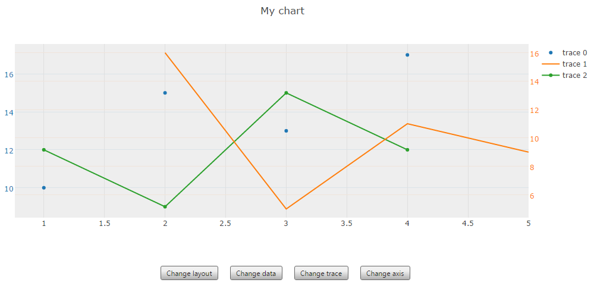

# qxCHART

qxCHART is a [Qooxdoo](http://qooxdoo.org/) wrapper for [Plotly](https://plot.ly/javascript/)



## 1. Add the qxCHART contrib to your project

* Download qxCHART
* Paste it in your project (e.g. within the top-level directory `contribs`)
* Add the following in your config.json file

```json
"jobs" : {
  "libraries" : {
    "library" : [{
      "manifest": "contribs/qxchart/Manifest.json"
      }
    ]
  }
  ...
}
```

More infos at http://manual.qooxdoo.org/devel/pages/development/contrib.html


## 2. Start using qxCHART

Create a chart's model :

```javascript
//Create chart's model
var chartModel = new ae.chart.model.Chart();
  
//Layout
var chartLayout = new ae.chart.model.layout.Layout().set({
	  title:"My chart"
});
chartModel.setLayout(chartLayout);

//First trace
var scatter = new ae.chart.model.trace.Scatter();
scatter.setX([1, 2, 3, 4]);
scatter.setY([10, 15, 13, 17]);
scatter.setMode("markers");

//Add trace to chart's model
var traces = new qx.data.Array();
traces.push(scatter);
chartModel.setTraces(traces);
```

Create a chart widget and pass the model as argument :

```javascript
var chartWidget = new ae.chart.ui.Chart(chartModel);
```

## 3. Examples

Here are some examples :
* [Basic chart](https://bl.ocks.org/adeliz/c4102cc7cb339acccfcfce4ae8007039)


## 4. Documentation

The full API documentation is available at https://rawgit.com/adeliz/qxchart/master/api/index.html#ae